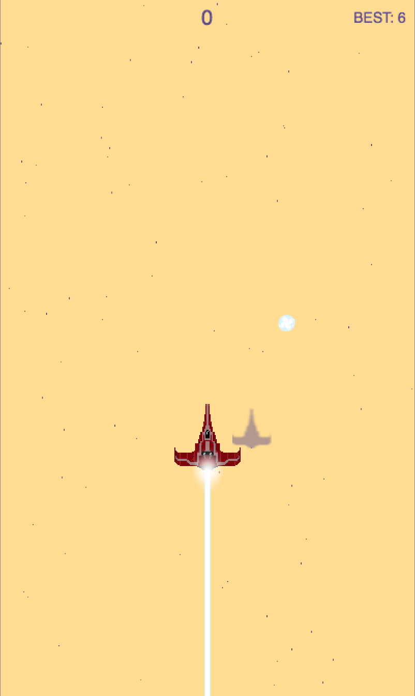

# Enerzoid

My game entry for the Ludum Dare 39 Compo (2017)

## Playable version

http://ludum-dare-39-game-enerzoid.surge.sh/

## Tools I've used

* Starter: https://github.com/rroylance/phaser-npm-webpack-typescript-starter-project
* GFX: http://piskelapp.com/ + GrafX2 + Adobe Photoshop + imageOptim
* Music: http://sb.bitsnbites.eu/ + Audacity + ffmpeg
* SFX: http://www.superflashbros.net/as3sfxr/ + http://sb.bitsnbites.eu/ + Audacity + ffmpeg

Thanks for playing :)

## Screenshots

